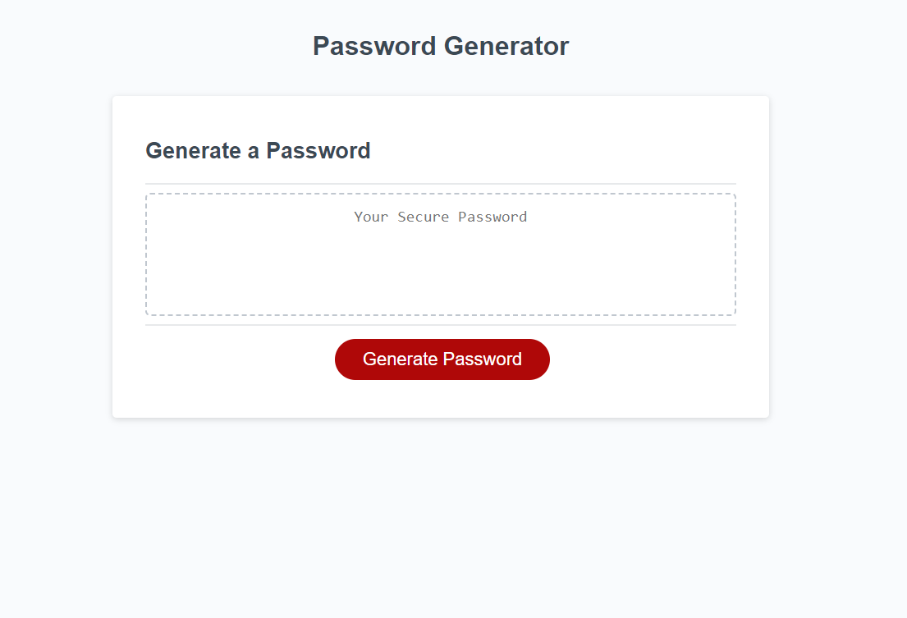

# Web Password Generator

## Description

This web application generates secure passwords based on user-defined criteria. It allows users to customize the length of the password and select the character types to include, such as lowercase letters, uppercase letters, numbers, and special characters. This was a homework challenge during bootcamp at UCB Ext. [Link to Deployed page](https://meanbean87.github.io/web-password-generator/).



## Technology Used

| Technology | Badge                                                             | Documentation                                                                       |
| ---------- | ----------------------------------------------------------------- | ----------------------------------------------------------------------------------- |
| HTML       |                | [HTML Documentation](https://developer.mozilla.org/en-US/docs/Web/HTML)             |
| CSS        |                    | [CSS Documentation](https://developer.mozilla.org/en-US/docs/Web/CSS)               |
| JavaScript |  | [JavaScript Documentation](https://developer.mozilla.org/en-US/docs/Web/JavaScript) |
| Git        |          | [Git Documentation](https://git-scm.com/)                                           |

## JavaScript Example

```JavaScript
const generatePassword = () => {
  let passwordLength = Number(
    prompt(
      "How many characters would you like your password to be?\nMust be between 8 and 128 characters"
    )
  );
  if (isNaN(passwordLength) || passwordLength < 8 || passwordLength > 128) {
    alert(
      "Password length must be a number between 8 and 128 characters.\nExample: 8 - 128"
    );
    generateBtn.removeEventListener("click", writePassword);
    return null;
  } else {
    //Prompt the user for each type of character they would like to include in the password.
    let includeLowercase = confirm(
      'Would you like to include lowercase letters?"\n"OK" for Yes, "Cancel" for No.'
    );
    let includeUppercase = confirm(
      'Would you like to include uppercase letters?"\n"OK" for Yes, "Cancel" for No.'
    );
    let includeNumbers = confirm(
      'Would you like to include numbers?"\n"OK" for Yes, "Cancel" for No.'
    );
    let includeSpecial = confirm(
      'Would you like to include special characters?"\n"OK" for Yes, "Cancel" for No.'
    );

    // If the user does not select at least one character type and
    // alert the user that at least one character type must be selected.
    if (
      !includeLowercase &&
      !includeUppercase &&
      !includeNumbers &&
      !includeSpecial
    ) {
      alert("You must select at least one character type. Please try again.");
      generateBtn.removeEventListener("click", writePassword);
      return null;
    } else {

      //Create an object to store the character Strings.
      const characterStrings = {
        lowercaseString: "abcdefghijklmnopqrstuvwxyz",
        uppercaseString: "ABCDEFGHIJKLMNOPQRSTUVWXYZ",
        numberString: "0123456789",
        specialString: "!@#$%^&*()_+~`|}{[]:;?><,./-=",
      };

      let selectedCharacters = "";
      //Adding the selected character types to the selectedCharacters.
      if (includeLowercase) {
        selectedCharacters += characterStrings.lowercaseString;
      }

      if (includeUppercase) {
        selectedCharacters += characterStrings.uppercaseString;
      }

      if (includeNumbers) {
        selectedCharacters += characterStrings.numberString;
      }

      if (includeSpecial) {
        selectedCharacters += characterStrings.specialString;
      }

      //Create a variable to store the randomly selected String from the user prompts.
      let randomString = "";

      //For loop to generate the password.
      for (let i = 0; i < passwordLength; i++) {
        randomString += selectedCharacters.charAt(
          Math.floor(Math.random() * selectedCharacters.length)
        );
      }

      generateBtn.removeEventListener("click", writePassword);
      return randomString;
    }
  }
};
```

## Learning Points

Use of event handlers and JavaScript to create dynamically rendered content. And the datatypes returned by using event handlers in JavaScript.

## Usage

To use the Web Password Generator:

1. Visit the deployed site [here](https://meanbean87.github.io/web-password-generator/).
2. Click on the "Generate Password" button.
3. A prompt will appear asking for the desired length of the password. Enter a number between 8 and 128.
4. You will then be prompted to include lowercase letters, uppercase letters, numbers, and special characters in the password. Click "OK" for yes or "Cancel" for no.
5. After confirming the character types, the generated password will be displayed in the text box.

## Author Info

Michael Mattingly

- GitHub: [meanbean87](https://github.com/meanbean87)
- LinkedIn: [Michael Mattingly](https://www.linkedin.com/in/michael-mattingly-5580b1280/)

## Credits

- The Web Password Generator was created by [meanbean87](https://github.com/meanbean87), with source code provided from UC Berkeley Extension.
- Favicon owned by Michael Mattingly.

## License

This project is licensed under the [MIT License](LICENSE).
